<!-- Animated Typing Header -->

  <b>Quant Systems Engineer · Low-Latency C++ · Autonomous AI Agents</b>

  
  

  
  
  

 

<!-- Animated Contribution Snake -->
<picture>
  <source media="(prefers-color-scheme: dark)" srcset="https://raw.githubusercontent.com/Akgithub2028/Akgithub2028/output/github-contribution-grid-snake-dark.svg" />
  <source media="(prefers-color-scheme: light)" srcset="https://raw.githubusercontent.com/Akgithub2028/Akgithub2028/output/github-contribution-grid-snake.svg" />
  
</picture>

<i>(Snake regenerates daily from live contribution activity — first render may take a minute after publishing)</i>

---

## 🌌 About Me

I build **low-latency market-making and execution systems** in C++ and Python, and **autonomous multi-agent AI platforms** that plan, retrieve, critique, and act on their own. My work sits at the intersection of quantitative microstructure research and production-grade agentic AI engineering.

- ⚡ **Quant Focus:** market microstructure, order-book dynamics, multi-alpha signal research, execution-cost analytics, backtesting & performance validation (Sharpe/Calmar, drawdown analysis).
- 🤖 **AI Focus:** hierarchical multi-agent orchestration, retrieval-augmented reasoning (RAG), self-reflective critic loops, and LLM-workflow infrastructure.
- 🧪 **Habits:** clean, documented, self-contained repos — every project ships with a working demo path, not just notebooks.

---

## 🛠 Tech Stack

<table>
<tr>
<td valign="top" width="50%">

**⚡ Quant & Low-Latency Systems**
 

 

 

 
Real-time market data ingestion, lock-free order-book structures, convex portfolio optimization, and deflated/probabilistic Sharpe validation.

</td>
<td valign="top" width="50%">

**🤖 Agentic AI & ML**
 

 
Hierarchical multi-agent orchestration, RAG pipelines with vector memory, and self-reflective critic loops.

</td>
</tr>
<tr>
<td valign="top" width="50%">

**🧩 Backend & Infra**
 

 
Multi-tenant service architecture with observability, caching, and containerized deployment.

</td>
<td valign="top" width="50%">

**🧪 Tooling & Research**
 

 
Reproducible research notebooks, typed front-end tooling, and CI-driven asset generation.

</td>
</tr>
</table>

---

## 🚀 Flagship Projects

### 📈 Quantitative Trading & Market Research

<table>
<tr>
<td width="50%" valign="top">

**[AlphaStack — Multi-Alpha Convex Optimization Engine](https://github.com/Akgithub2028/Multi-Alpha-Engineering-Convex-Optimization-Engine)**

 
 

Research framework to discover, combine, and convex-optimize multi-alpha signals into market-resilient portfolios.

</td>
<td width="50%" valign="top">

**[ApexFlow](https://github.com/Akgithub2028/ApexFlow)**

 
 

Low-latency crypto ETP market-making and cross-exchange execution research platform.

</td>
</tr>
<tr>
<td width="50%" valign="top">

**[VenueWatch](https://github.com/Akgithub2028/VenueWatch)**

 
 

Normalizes, measures, and statistically validates real-time order-book liquidity, execution slippage, and infrastructure reliability across Binance, Coinbase, Kraken, and OKX.

</td>
<td width="50%" valign="top">

**[IMC Prosperity 4 Backtester](https://github.com/Akgithub2028/IMC-Prosperity-4-Backtester)**

 
 

Pure-Python backtesting engine with built-in PnL charts, drawdown analysis, Sharpe/Calmar metrics, and Colab support. Clone → overwrite trader → run.

</td>
</tr>
</table>

### 🤖 Autonomous Multi-Agent AI Systems

<table>
<tr>
<td width="50%" valign="top">

**[Autonomous AI Co-Scientist](https://github.com/Akgithub2028/Autonomous-AI-Co-Scientist)**

 
 

Extends Google's AI Co-Scientist with modular multi-agent orchestration, retrieval-augmented reasoning, long-term memory, automated evaluation, benchmarking, and Docker deployment.

</td>
<td width="50%" valign="top">

**[VoRTeX](https://github.com/Akgithub2028/VoRTeX)**

 
 

Self-hostable AI execution engine in Python 3.12 with FastAPI, PostgreSQL 16, Redis 7, and OpenTelemetry — architected for multi-tenant SaaS LLM-workflow orchestration.

</td>
</tr>
</table>

---

<b>📂 More Projects — click to expand</b>

 

| Repository | Language | Description |
| :--- | :---: | :--- |
| [Real-Time-Market-Making-Execution-Engine](https://github.com/Akgithub2028/Real-Time-Market-Making-Execution-Engine) | `C++` | Production-grade, low-latency electronic market-making system built to demonstrate quantitative microstructure and high-performance C++ systems engineering. |
| [AutoResearch](https://github.com/Akgithub2028/AutoResearch) | `Python` | Self-reflective, hierarchical multi-agent research platform. |
| [Production-Grade-Multi-Agent-AI-Content-Generation-Platform](https://github.com/Akgithub2028/Production-Grade-Multi-Agent-AI-Content-Generation-Platform) | `Python` | Hierarchical multi-agent AI system for autonomous, research-grounded blog generation. |
| [Evolutionary-Neural-Architecture-Search](https://github.com/Akgithub2028/Evolutionary-Neural-Architecture-Search) | `Jupyter / PyTorch` | Lightweight, native Neural Architecture Search framework driven by a custom-built genetic algorithm. |
| [Distributed-In-Memory-Key-Value-Store](https://github.com/Akgithub2028/Distributed-In-Memory-Key-Value-Store) | `C++` | High-performance, distributed, in-memory caching engine and key-value database. |
| [MultiClass_Image_Classification_Using_CNN](https://github.com/Akgithub2028/MultiClass_Image_Classification_Using_CNN) | `Jupyter Notebook` | CNN model classifying Alzheimer's disease risk across 44,000 human brain MRI images into 4 risk tiers. |
| [Media-Bias-Mitigation-](https://github.com/Akgithub2028/Media-Bias-Mitigation-) | `Python` | Mitigates ideological media bias across 5 news sources and Twitter via a bias-mitigated summary chatbot. |
| [MinimalBlockChainPy](https://github.com/Akgithub2028/MinimalBlockChainPy) | `Python` | Minimal blockchain implementation demonstrating proof-of-work, hashing, and cryptographic ledger consensus. |

---

## 📊 GitHub Analytics

   
  
  
    
  

<i>These cards are generated and committed by a GitHub Action every 24h — no third-party runtime dependency, so they won't go blank.</i>

---

## 📬 Connect

  
  &nbsp;&nbsp;
  

 

  Built for speed, in more ways than one — <b>LatencySlayerX</b>

